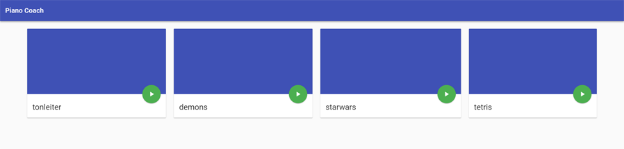

Piano Coach
===

Piano Coach is a small project I set up for my own efforts to learn playing the piano.

It can read MusicXML files, display the notes and show your progress when playing the correct keys on a midi connected device.

While learning to play the piano, I've tried both the apps Flowkey and Yousician. They both have their pros and cons and it felt I that I would really like to mix them together for the best experience. This project is my attempt to do so.

Please feel free to support the project via code contributions, suggestions or by simply using it.
